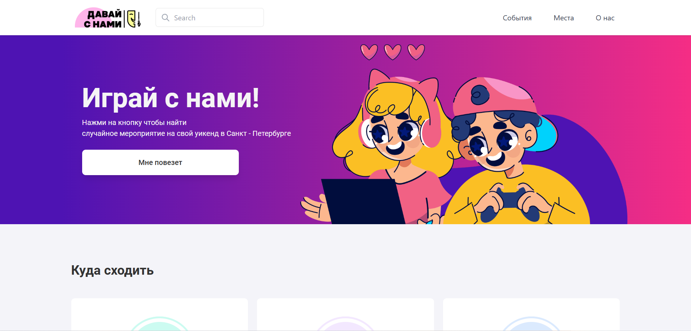
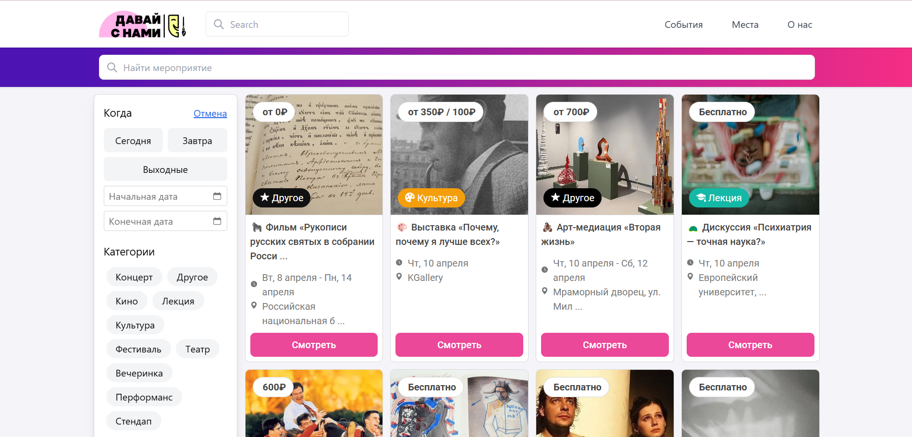
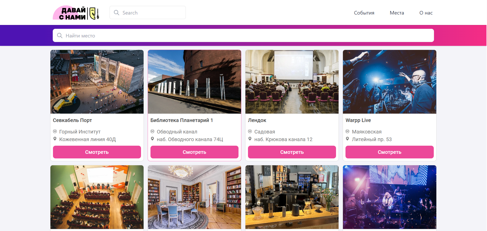

# 🎉 Project "Davai s nami" — Find Events in Saint Petersburg

  

<p align="center">
  <a href="https://davai-s-nami.vercel.app/" target="_blank">
    
  </a>
  <a href="https://github.com/elfototo/davai-s-nami" target="_blank">
    
  </a>
</p>

> **A modern web app to explore events in Saint Petersburg — search by date, category, or get lucky! Built with Next.js, integrated with Telegram, and deployed on Vercel.**

## 📚 Table of Contents
- [🎉 Project "Davai s nami" — Find Events in Saint Petersburg](#-project-davai-s-nami--find-events-in-saint-petersburg)
  - [📚 Table of Contents](#-table-of-contents)
  - [🎯 General Project Description](#-general-project-description)
  - [🖥 System Requirements](#-system-requirements)
  - [🐳 Docker Hub Repository](#-docker-hub-repository)
    - [Image Tags:](#image-tags)
  - [⚙️ Installation Guide](#️-installation-guide)
    - [Installation and Launch via Docker](#installation-and-launch-via-docker)
  - [🔒 Security Notes](#-security-notes)
  - [🚀 Deployment on Vercel](#-deployment-on-vercel)
  - [💡 Usage](#-usage)
  - [⚙️ Tech Stack](#️-tech-stack)
  - [📸 Screenshots](#-screenshots)

---

## 🎯 General Project Description

The project is a frontend website built using **Next.js**. It allows users to search for events in Saint Petersburg by category, date, and popular locations. All events are aggregated on the backend and displayed on the site. The website functions as a web application and is also accessible via a Telegram bot.

**Key features of the project:**
- Search for events by category and date.
- A **"Мне повезет"** button that randomly selects and displays a single event.
- A page showcasing popular venues in the city, with the ability to see upcoming events at those locations.
- The site is also available in **Telegram** as an app via a bot.
- The site is hosted on **Vercel** and available at [this link](https://davai-s-nami.vercel.app/).

---

## 🖥 System Requirements

- **Docker** version 28.0.4 or higher.
- **Node.js** version 18.x or higher (if Docker is not used).
- **npm** (for installing dependencies).

---

## 🐳 Docker Hub Repository

The image is available on Docker Hub: [elfototo/davai-s-nami](https://hub.docker.com/repository/docker/elfototo/davai-s-nami).

### Image Tags:
- **latest** — the latest stable version.
- **1fa8c6e3d311e5474c06c1d8791db84865186487** — older versions used for testing.

---

## ⚙️ Installation Guide

### Installation and Launch via Docker

1. **Clone the repository:**

    ```bash
    git clone https://github.com/elfototo/davai-s-nami.git
    cd davai-s-nami
    ```

2. **Create a `.env` file to store environment variables.**

    Example content of the `.env` file:

    ```javascript
    NEXT_PUBLIC_API_URL=https://your-api-url.com
    NEXT_PUBLIC_API_KEY=your-api-key
    NEXT_PUBLIC_API_HEADERS={ 'Authorization': 'Bearer your-token', 'Content-Type': 'application/json' }
    ```

3. **Build and run the Docker container:**

    In the project root, build the image:

    ```bash
    docker build -t elfototo/davai-s-nami .
    ```

    Then run the container:

    ```bash
    docker run -p 3000:3000 --env-file .env elfototo/davai-s-nami
    ```

4. **Open your browser and go to** `http://localhost:3000` **to see the running project.**

---

## 🔒 Security Notes

- **Hiding API keys:** Never store API keys or other sensitive data in public repositories. Use environment variables (e.g., `.env`).
- Make sure your `.env` file is listed in `.gitignore` so that it is not committed to the repository.

---

## 🚀 Deployment on Vercel

1. Go to [Vercel](https://vercel.com) and create a new project.
2. Link your GitHub repository.
3. Add all environment variables from `.env` to Vercel's environment settings.
4. Vercel will automatically deploy your application after each push to the repository.

---

## 💡 Usage

1. **Event Search:** On the homepage, users can filter events by category and date. A convenient filter is available on the events page.
2. **"Мне повезет" Button:** This button randomly selects a single event and displays it in a modal window.
3. **Popular Places:** The **"Places"** tab displays the most popular venues in the city. On each place's page, users can see upcoming events held there.

---

## ⚙️ Tech Stack


## 📸 Screenshots

| Home Page | Event Modal | Popular Places |
|-----------|-------------|----------------|
|  |  |  |